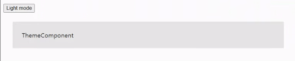

**TOC**

- [useContext](#usecontext)
  - [Context](#context)
      - [Passing props \& Prop drilling](#passing-props--prop-drilling)
  - [useContext](#usecontext-1)
      - [Parameters](#parameters)
      - [Returns](#returns)
  - [사용법](#사용법)
      - [일반적인 사용법](#일반적인-사용법)
      - [Custom Hook으로 사용하는 법](#custom-hook으로-사용하는-법)
  - [TL;DR](#tldr)

# useContext

[useContext](https://beta.reactjs.org/reference/react/useContext)는 리액트의 상태를 관리하는 훅으로 context를 읽고 구독할 수 있게 해준다.

## Context

그렇다면 도대체 [context](https://beta.reactjs.org/learn/passing-data-deeply-with-context)는 무엇일까?

우리는 데이터를 부모 컴포넌트에서 자녀 컴포넌트로 props를 통해 전달한다. 하지만, props가 필요한 자녀 컴포넌트에 도달하는 과정에 수많은 컴포넌트가 있을 수 있다. 이런 컴포넌트가 열 개만 되어도 복잡할 텐데, 수백수천 개가 된다고 생각하면 머리가 어지럽다.

이러한 문제를 우린 context를 사용해 해결할 수 있다.
context는 props의 전달 없이 데이터를 접근할 수 있게 해준다.

#### Passing props & Prop drilling

props를 전달하는 것은 데이터를 UI 트리에 전달하는 좋은 방식이다.
하지만 props 전달이 깊어질수록 이해하기 어렵고 불편해진다. 또한 많은 컴포넌트를 통과해 props를 전달하면 prop drilling을 초래한다.

**prop drilling**

<p align="center">
  
</p>

이러한 문제점을 해결하기 위해 우리는 useContext 훅을 사용한다.

<br/>

## useContext

useContext 훅을 최상단에 불러온 후 사용한다.
useContext를 사용하면 props 전달 없이 props에 접근할 수 있다. ➡️ prop drilling 역시 방지

```jsx
import { useContext } from "react";
import { ThemeContext } from "./App";

const ThemeComponent = () => {
  const darkTheme = useContext(ThemeContext);
  // ...
};
```

#### Parameters

useContext는 파라미터로 createContext로 생성된 context를 받는다.
이때 context 자체는 정보를 갖고 있지 않는다. ➡️ 정보를 제공하거나 읽을 뿐

#### Returns

useContext는 context value를 훅이 불린 곳에서 반환한다.
컴포넌트 최상단의 Provider에서 value로 값이 정해진다. 이때 value 값이 없다면 createContext의 기본 value를 반환한다.

<br/>

## 사용법

#### 일반적인 사용법

1.  App.jsx 혹은 index.jsx에서 사용할 context를 createContext로 생성한다.

```jsx
// App.jsx
import { createContext } from "react";

const ThemeContext = createContext();
```

2. 반환된 context의 value가 필요한 컴포넌트를 Provider을 사용해 감싸준다.

```jsx
// App.jsx
<ThemeContext.Provider value={darkTheme}>
  <button type="button" onClick={handleClickTheme}>
    {darkTheme ? "Dark mode" : "Light mode"}
  </button>
  <ThemeComponent />
</ThemeContext.Provider>
```

이때 받을 value를 Provider에 제공한다.

3. context의 value가 필요한 컴포넌트에서 useContext를 사용해 value에 접근한다.

```jsx
// ThemeComponent.jsx
import { useContext } from "react";
import { ThemeContext } from "./App";

const ThemeComponent = () => {
  const darkTheme = useContext(ThemeContext);
  const themeStyles = {
    backgroundColor: darkTheme ? "#333" : "#e7e7e7",
    color: darkTheme ? "#e7e7e7" : "#333",
    padding: 24,
    margin: 24,
  };

  return <div style={themeStyles}>ThemeComponent</div>;
};
export default ThemeComponent;
```

useContext를 사용해 props 전달 없이 상태를 관리할 수 있다. 또한 중간에 얼마나 많은 계층의 컴포넌트가 있든지 value를 전달받는다.

#### Custom Hook으로 사용하는 법

1. 기존에 App.jsx에 작성된 로직들을 새로운 파일로 분리해 준다.

```jsx
// ThemeContext.jsx
import { useState, useContext, createContext } from "react";

const ThemeContext = createContext(null); // theme
const ThemeUpdateContext = createContext(null); // update theme

export const ThemeProvider = ({ children }) => {
  const [darkTheme, setDarkTheme] = useState(false);
  const handleClickTheme = () => {
    setDarkTheme((prev) => !prev);
  };

  return (
    <ThemeContext.Provider value={darkTheme}>
      <ThemeUpdateContext.Provider value={handleClickTheme}>
        {children}
      </ThemeUpdateContext.Provider>
    </ThemeContext.Provider>
  );
};
```

context를 생성한 후 함수형 컴포넌트를 만든 후 Provider를 사용해 감싸준다.
우리는 theme을 업데이트해주는 함수를 사용하고 있으므로, 함수에 접근할 수 있는 context를 생성해 준다.

이때 children prop을 사용해 컴포넌트들을 받아 준다.

2. App.jsx의 기존 Provider를 ThemeProvider로 대체한다.

```jsx
// App.jsx
import { ThemeProvider } from "./ThemeContext";
import ThemeComponent from "./ThemeComponent";

function App() {
  return (
    <ThemeProvider>
      <ThemeComponent />
    </ThemeProvider>
  );
}

export default App;
```

이렇게 하면 기존의 로직 보다 훨씬 가독성이 좋아진 것을 알 수 있다.

3. Custom Hook을 만들어 context의 value가 필요한 곳에서 접근할 수 있도록 해준다.

```jsx
// ThemeContext.jsx

// ...
export const useTheme = () => {
  return useContext(ThemeContext);
};

export const useThemeUpdate = () => {
  return useContext(ThemeUpdateContext);
};
// ...

return (
  <ThemeContext.Provider value={darkTheme}>
    <ThemeUpdateContext.Provider value={handleClickTheme}>
      {children}
    </ThemeUpdateContext.Provider>
  </ThemeContext.Provider>
);
```

- useTheme hook : theme의 context value를 리턴해주는 훅
- useThemeUpdate hook themed을 업데이트하는 context value를 리턴해주는 훅

4. context가 필요한 컴포넌트에서 생성한 Custom Hook을 사용한다

```jsx
// ThemeComponent.jsx
import { useTheme, useThemeUpdate } from "./ThemeContext";
const ThemeComponent = () => {
  const darkTheme = useTheme();
  const handleClickTheme = useThemeUpdate();
  const themeStyles = {
    backgroundColor: darkTheme ? "#333" : "#e7e7e7",
    color: darkTheme ? "#e7e7e7" : "#333",
    padding: 24,
    margin: 24,
  };

  return (
    <>
      <button type="button" onClick={handleClickTheme}>
        {darkTheme ? "Dark mode" : "Light mode"}
      </button>
      <div style={themeStyles}>ThemeComponent</div>
    </>
  );
};
export default ThemeComponent;
```

</br>

<p align="center">
  
</p>

<br/>

## TL;DR

1. Context는 props의 전달 없이 데이터에 접근할 수 있게 해준다.
2. 이때 useContext를 사용한다.
3. Custom Hook을 이용하면 가독성을 높일 수 있다.

[출처](https://beta.reactjs.org/reference/react/useContext)
