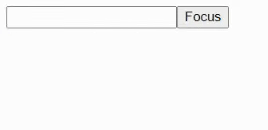

**TOC**

- [useRef](#useref)
  - [기본 문법](#기본-문법)
    - [ref란?](#ref란)
    - [파라미터](#파라미터)
    - [반환 값](#반환-값)
  - [사용법](#사용법)
    - [ref를 통한 값 참조](#ref를-통한-값-참조)
      - [ref를 사용으로 보장 받는 것](#ref를-사용으로-보장-받는-것)
    - [ref를 이용한 돔 조작](#ref를-이용한-돔-조작)
      - [돔을 조작하기 위한 과정](#돔을-조작하기-위한-과정)
  - [TL;DR](#tldr)

# useRef

[useRef](https://beta.reactjs.org/reference/react/useRef)는 렌더링에 필요하지 않은 값을 참조할 수 있게 해주는 훅이다.

```jsx
const ref = useRef(initialValue);
```

<br/>

## 기본 문법

[ref](https://beta.reactjs.org/learn/referencing-values-with-refs)를 선언하기 위해 `useRef`를 컴포넌트 최상단에 불러온다.

### ref란?

어떤 정보를 기억하고 싶은데, 새로운 렌더링을 하고 싶지 않을 때 사용하는 것이 ref이다.

### 파라미터

- initialValue : current 프로퍼티의 초깃값으로 어떤 타입도 가능하다.

### 반환 값

useRef는 하나의 프로퍼티를 가진 객체를 반환한다.

- current : 초기에는 우리가 설정한 initialValue로 설정된다. 후에 JSX node의 ref 속성에 넘겨주면 리액트가 current 프로퍼티를 설정한다.

다음 렌더링에도 useRef는 같은 객체를 반환한다.

<br/>

## 사용법

### ref를 통한 값 참조

useRef는 initialValue가 설정된 current 프로퍼티를 가진 객체를 반환한다.

다음 렌더링에도 같은 객체를 반환한다. current 프로퍼티를 바꾸고 나중에 읽어들일 수 있다.
ref는 아마 state를 떠올리게 할 것이다.

하지만 ref와 state는 아주 큰 차이점이 있다.
ref는 리렌더링의 트리거가 되지 않는다. ref는 정보를 담기에 가장 좋은 선택이라는 것이다.

#### ref를 사용으로 보장 받는 것

- 리렌더링 사이에 정보를 저장할 수 있다.
- ref 변경은 새로운 렌더링의 트리거가 되지 않는다.
- 지역적인 정보를 갖는다.

> ✨ 정보를 화면에 보여주기 위해선 ref 대신 state를 사용하자

### ref를 이용한 돔 조작

ref를 이용해 돔을 조작하는 것은 매우 흔한 방식이다.

#### 돔을 조작하기 위한 과정

1. ref 객체를 선언한다.

```jsx
import { useRef } from "react";

const Component = () => {
  const inputRef = useRef(null);

  // ...
};
```

2. ref를 JSX에 넘겨준다.

```jsx
// ...
return <input ref={inputRef} />;
```

3. 리액트는 current 프로퍼티에 ref를 받은 돔 node를 설정한다.

```jsx
// ...
console.log(inputRef); // { current: <input></input> }
```

4. 우리는 이제 `focus`와 같이 돔을 조작하는 메서드에 접근할 수 있다.

```jsx
import { useRef } from "react";

export default function App() {
  const inputRef = useRef(null);

  const handleClick = () => inputRef.current.focus();

  return (
    <>
      <input ref={inputRef} />
      <button type="button" onClick={handleClick}>
        Focus
      </button>
    </>
  );
}
```

<p align="center">
  
</p>

리액트는 노드가 지워졌을 때 current 프로퍼티를 다시 null로 설정한다.

## TL;DR

1. 리렌더링을 일으키지 않고 정보를 참조하고 싶을 때 useRef를 사용한다.
2. useRef는 current 프로퍼티를 가진 객체를 반환한다.
3. useRef를 이용해 돔을 조작할 수 있다.
